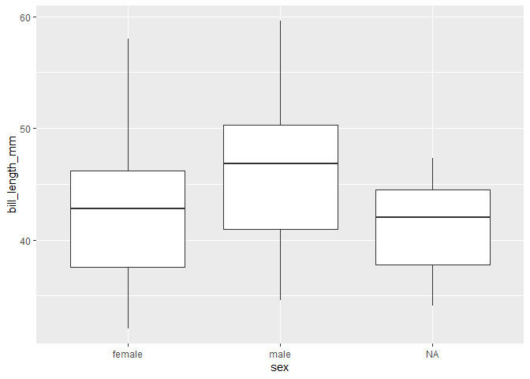
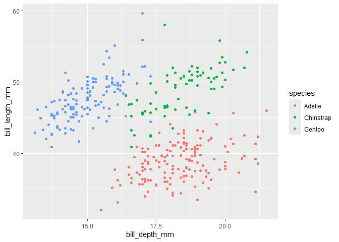
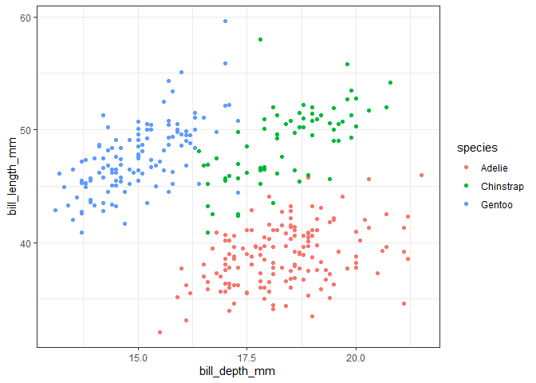

Git, Github, dplyr og ggplot for biostat
================

## En rask intro til dplyr

Pakken tidyverse laster inn pakkene dplyr,, readr, forcats, stringr,
ggplot2, tibble, lubridate, tidyr, purrr. Disse fungerer godt sammen med
pipes.

En *pipe* er symbolet %\>% (eller \|\>) med hurtigtast ctrl-shift-m.

Pipen tar innholdet på venstre side og legger det som første argument
til funksjonen på høyre side .

- x %\>% f(y) er det samme som f(x,y)

- x %\>% mean(y) er det samme som mean(x\$y)

Vi ser på det med datasettet penguins fra palmerpenguins biblioteket
(installer om nødvendig)

Under skal vi prøve grunnleggende syntaks for dplyr og se om det blir
likt som “base R”

``` r
#last inn data
penguins <- palmerpenguins::penguins

#base R
head(penguins)
```

    ## # A tibble: 6 × 8
    ##   species island    bill_length_mm bill_depth_mm flipper_length_mm body_mass_g
    ##   <fct>   <fct>              <dbl>         <dbl>             <int>       <int>
    ## 1 Adelie  Torgersen           39.1          18.7               181        3750
    ## 2 Adelie  Torgersen           39.5          17.4               186        3800
    ## 3 Adelie  Torgersen           40.3          18                 195        3250
    ## 4 Adelie  Torgersen           NA            NA                  NA          NA
    ## 5 Adelie  Torgersen           36.7          19.3               193        3450
    ## 6 Adelie  Torgersen           39.3          20.6               190        3650
    ## # ℹ 2 more variables: sex <fct>, year <int>

``` r
# Tidy
penguins %>% 
  head()
```

    ## # A tibble: 6 × 8
    ##   species island    bill_length_mm bill_depth_mm flipper_length_mm body_mass_g
    ##   <fct>   <fct>              <dbl>         <dbl>             <int>       <int>
    ## 1 Adelie  Torgersen           39.1          18.7               181        3750
    ## 2 Adelie  Torgersen           39.5          17.4               186        3800
    ## 3 Adelie  Torgersen           40.3          18                 195        3250
    ## 4 Adelie  Torgersen           NA            NA                  NA          NA
    ## 5 Adelie  Torgersen           36.7          19.3               193        3450
    ## 6 Adelie  Torgersen           39.3          20.6               190        3650
    ## # ℹ 2 more variables: sex <fct>, year <int>

### Oppsummere data med dplyr

Pipen gjør at første argument i funksjonen er det som kommer før pipen.

For å oppsummere data med tidyverse bruker man “summarise” funksjonene.
Disse tar en vektor med verdier og returnerer en enkeltverdi, f.eks:

- first/last/nth: første/siste/n-te verdi

- min/max: minimum og maksimumsverdi

- IQR/sd/var: interquartile range, standardavvik og varians

``` r
mean(penguins$body_mass_g, na.rm=T)
```

    ## [1] 4201.754

``` r
penguins %>% 
  summarise(mean_bmg = mean(body_mass_g, na.rm = T))
```

    ## # A tibble: 1 × 1
    ##   mean_bmg
    ##      <dbl>
    ## 1    4202.

### Piper i sekvens

Pipene er aller mest nyttig når man skal gjøre flere steg i sekvens på
samme datasett

Vi ser at det er noen pingviner som har NA for målinger. Da kan vi bruke
piper i sekvens til å fjerne rader med NA verdier før vi tar mean.

Filtrering av rader gjør man med funksjon filter() sammen med f.eks
logiske operatører \>, \<, ==, !=, \|, &

``` r
#Tar bort de som mangler body mass måling
penguins %>% 
  filter(!is.na(body_mass_g)) %>%
  summarise(mean_bmg = mean(body_mass_g))
```

    ## # A tibble: 1 × 1
    ##   mean_bmg
    ##      <dbl>
    ## 1    4202.

``` r
# Kan legge på flere filtreringer
# f.eks bare se på damepingviner fra Biscoe
penguins %>% 
  filter(!is.na(body_mass_g),
         sex=="female",
         island=="Biscoe") %>%
  summarise(mean_bmg = mean(body_mass_g))
```

    ## # A tibble: 1 × 1
    ##   mean_bmg
    ##      <dbl>
    ## 1    4319.

### Velge variabler

Man kan filtrere variabler med select. Det er mange nyttige funksjoner
som fungerer sammen med select, f.eks:

- select(penguins, all_of(c(“species”,“island”)) - tar med alle nevnte
  variabler (varianter: any_of(), one_of() )

- select(penguins, ends_with(“mm”)) - tar med alle variabler som ender
  med mm (varianter: startswith(), contains() )

- select(penguins, -species) - tar med alle variabler utenom species

``` r
#filter to subset observations
penguins %>%
  filter(island=="Dream")%>%
  filter(bill_length_mm<200)%>%
  head()
```

    ## # A tibble: 6 × 8
    ##   species island bill_length_mm bill_depth_mm flipper_length_mm body_mass_g
    ##   <fct>   <fct>           <dbl>         <dbl>             <int>       <int>
    ## 1 Adelie  Dream            39.5          16.7               178        3250
    ## 2 Adelie  Dream            37.2          18.1               178        3900
    ## 3 Adelie  Dream            39.5          17.8               188        3300
    ## 4 Adelie  Dream            40.9          18.9               184        3900
    ## 5 Adelie  Dream            36.4          17                 195        3325
    ## 6 Adelie  Dream            39.2          21.1               196        4150
    ## # ℹ 2 more variables: sex <fct>, year <int>

``` r
#select to subset variables
penguins %>%
  select(species, island, body_mass_g)%>%
  head()
```

    ## # A tibble: 6 × 3
    ##   species island    body_mass_g
    ##   <fct>   <fct>           <int>
    ## 1 Adelie  Torgersen        3750
    ## 2 Adelie  Torgersen        3800
    ## 3 Adelie  Torgersen        3250
    ## 4 Adelie  Torgersen          NA
    ## 5 Adelie  Torgersen        3450
    ## 6 Adelie  Torgersen        3650

``` r
#Combine and assign
penguins_filt <- penguins %>%
  filter(island=="Dream",
         bill_length_mm<200)%>%
  select(species, island, bill_length_mm, body_mass_g)

head(penguins_filt)
```

    ## # A tibble: 6 × 4
    ##   species island bill_length_mm body_mass_g
    ##   <fct>   <fct>           <dbl>       <int>
    ## 1 Adelie  Dream            39.5        3250
    ## 2 Adelie  Dream            37.2        3900
    ## 3 Adelie  Dream            39.5        3300
    ## 4 Adelie  Dream            40.9        3900
    ## 5 Adelie  Dream            36.4        3325
    ## 6 Adelie  Dream            39.2        4150

## Summarize data

``` r
# Count penguins for each species / island
penguins %>%
  count(species, island, .drop = FALSE)
```

    ## # A tibble: 9 × 3
    ##   species   island        n
    ##   <fct>     <fct>     <int>
    ## 1 Adelie    Biscoe       44
    ## 2 Adelie    Dream        56
    ## 3 Adelie    Torgersen    52
    ## 4 Chinstrap Biscoe        0
    ## 5 Chinstrap Dream        68
    ## 6 Chinstrap Torgersen     0
    ## 7 Gentoo    Biscoe      124
    ## 8 Gentoo    Dream         0
    ## 9 Gentoo    Torgersen     0

``` r
penguins %>%
  dplyr::select(body_mass_g, ends_with("_mm")) %>% 
  head()
```

    ## # A tibble: 6 × 4
    ##   body_mass_g bill_length_mm bill_depth_mm flipper_length_mm
    ##         <int>          <dbl>         <dbl>             <int>
    ## 1        3750           39.1          18.7               181
    ## 2        3800           39.5          17.4               186
    ## 3        3250           40.3          18                 195
    ## 4          NA           NA            NA                  NA
    ## 5        3450           36.7          19.3               193
    ## 6        3650           39.3          20.6               190

### Bruker “summarise” funksjonene

``` r
#summarise funksjonen oppsummerer data
penguins %>%
  summarise(n=n(),
            mean_bl = mean(bill_length_mm, na.rm = T),
            mean_bd = mean(bill_depth_mm, na.rm = T)
            )
```

    ## # A tibble: 1 × 3
    ##       n mean_bl mean_bd
    ##   <int>   <dbl>   <dbl>
    ## 1   344    43.9    17.2

``` r
#Kan legge inn gruppe for å få gruppevis
penguins %>%
  group_by(island)%>%
  summarise(n=n(),
            mean_bl = mean(bill_length_mm, na.rm = T),
            mean_bd = mean(bill_depth_mm, na.rm = T)
            )
```

    ## # A tibble: 3 × 4
    ##   island        n mean_bl mean_bd
    ##   <fct>     <int>   <dbl>   <dbl>
    ## 1 Biscoe      168    45.3    15.9
    ## 2 Dream       124    44.2    18.3
    ## 3 Torgersen    52    39.0    18.4

``` r
penguins %>%
  group_by(island, sex)%>%
  summarise(n=n(),
            mean_bl = mean(bill_length_mm, na.rm = T),
            mean_bd = mean(bill_depth_mm, na.rm = T)
            )
```

    ## `summarise()` has grouped output by 'island'. You can override using the
    ## `.groups` argument.

    ## # A tibble: 9 × 5
    ## # Groups:   island [3]
    ##   island    sex        n mean_bl mean_bd
    ##   <fct>     <fct>  <int>   <dbl>   <dbl>
    ## 1 Biscoe    female    80    43.3    15.2
    ## 2 Biscoe    male      83    47.1    16.6
    ## 3 Biscoe    <NA>       5    45.6    14.6
    ## 4 Dream     female    61    42.3    17.6
    ## 5 Dream     male      62    46.1    19.1
    ## 6 Dream     <NA>       1    37.5    18.9
    ## 7 Torgersen female    24    37.6    17.6
    ## 8 Torgersen male      23    40.6    19.4
    ## 9 Torgersen <NA>       5    37.9    18.2

## Basic ggplot plotting

Programmet ggplot (grammar of graphics) har tre grunnleggende elementer:

data: en dataframe med input til figur estetikk (aes()) : spesifiser x,
y, farge, form, størrelse geometri: spesifiser hvordan

ggplot er modulært så kan bygges på med modifikasjoner i det uendelige.

``` r
penguins %>%
  ggplot(aes(x=sex, y=bill_length_mm))+
  geom_boxplot()
```

    ## Warning: Removed 2 rows containing non-finite outside the scale range
    ## (`stat_boxplot()`).

<!-- -->

``` r
penguins %>%
  ggplot(aes(x=bill_depth_mm, y=bill_length_mm, color=species))+
  geom_point()
```

    ## Warning: Removed 2 rows containing missing values or values outside the scale range
    ## (`geom_point()`).

<!-- -->

``` r
penguins %>%
  ggplot(aes(x=bill_depth_mm, y=bill_length_mm, color=species))+
  geom_point()+
  theme_bw()
```

    ## Warning: Removed 2 rows containing missing values or values outside the scale range
    ## (`geom_point()`).

<!-- -->

Kan bruke dlkyr til å pipe data rett i en pca

``` r
penguin.pca <- penguins %>%
  filter(!is.na(sex))%>%
  select(bill_length_mm:body_mass_g) %>%
  prcomp()


penguin.pca$x %>%
  ggplot(aes(x=PC1, y=PC2, color = penguins %>%  filter(!is.na(sex)) %>%pluck("species") ))+
  geom_point()
```

<!-- -->

``` r
penguin.pca$rotation %>%
  ggplot(aes(x=PC1, y=PC2, label=row.names(penguin.pca$rotation)))+
  geom_text()
```

<!-- -->

``` r
penguins %>%
  ggplot(aes(x=flipper_length_mm, y=bill_depth_mm
             , colour = species
))+
  geom_point()+
  geom_smooth(method = "lm", se = FALSE)
```

    ## `geom_smooth()` using formula = 'y ~ x'

    ## Warning: Removed 2 rows containing non-finite outside the scale range
    ## (`stat_smooth()`).

    ## Warning: Removed 2 rows containing missing values or values outside the scale range
    ## (`geom_point()`).

<!-- -->
