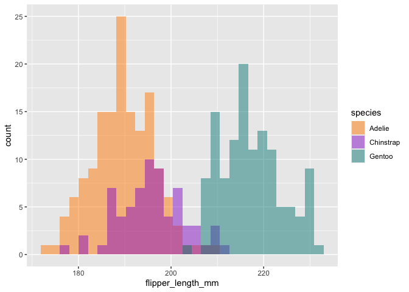

Git, Github, dplyr og ggplot for biostat
================

# En rask intro til dplyr

Pakken tidyverse laster inn pakkene dplyr,, readr, forcats, stringr,
ggplot2, tibble, lubridate, tidyr, purrr. Disse fungerer godt sammen med
pipes.

En *pipe* er symbolet %\>% (eller \|\>) med hurtigtast ctrl-shift-m.

Pipen tar innholdet på venstre side og legger det som første argument
til funksjonen på høyre side .

- x %\>% f(y) er det samme som f(x,y)

- x %\>% mean(y) er det samme som mean(x\$y)

Vi ser på det med datasettet penguins fra palmerpenguins biblioteket
(installer om nødvendig)

Under skal vi prøve grunnleggende syntaks for dplyr og se om det blir
likt som “base R”

``` r
#last inn data
penguins <- palmerpenguins::penguins

#base R
head(penguins)
```

    ## # A tibble: 6 × 8
    ##   species island    bill_length_mm bill_depth_mm flipper_length_mm body_mass_g
    ##   <fct>   <fct>              <dbl>         <dbl>             <int>       <int>
    ## 1 Adelie  Torgersen           39.1          18.7               181        3750
    ## 2 Adelie  Torgersen           39.5          17.4               186        3800
    ## 3 Adelie  Torgersen           40.3          18                 195        3250
    ## 4 Adelie  Torgersen           NA            NA                  NA          NA
    ## 5 Adelie  Torgersen           36.7          19.3               193        3450
    ## 6 Adelie  Torgersen           39.3          20.6               190        3650
    ## # ℹ 2 more variables: sex <fct>, year <int>

``` r
# Tidy
penguins %>% 
  head()
```

    ## # A tibble: 6 × 8
    ##   species island    bill_length_mm bill_depth_mm flipper_length_mm body_mass_g
    ##   <fct>   <fct>              <dbl>         <dbl>             <int>       <int>
    ## 1 Adelie  Torgersen           39.1          18.7               181        3750
    ## 2 Adelie  Torgersen           39.5          17.4               186        3800
    ## 3 Adelie  Torgersen           40.3          18                 195        3250
    ## 4 Adelie  Torgersen           NA            NA                  NA          NA
    ## 5 Adelie  Torgersen           36.7          19.3               193        3450
    ## 6 Adelie  Torgersen           39.3          20.6               190        3650
    ## # ℹ 2 more variables: sex <fct>, year <int>

## Oppsummere data med dplyr

Pipen gjør at første argument i funksjonen er det som kommer før pipen.

For å oppsummere data med tidyverse bruker man “summarise” funksjonene.
Disse tar en vektor med verdier og returnerer en enkeltverdi, f.eks:

- first/last/nth: første/siste/n-te verdi

- min/max: minimum og maksimumsverdi

- IQR/sd/var: interquartile range, standardavvik og varians

``` r
mean(penguins$body_mass_g, na.rm=T)
```

    ## [1] 4201.754

``` r
penguins %>% 
  summarise(mean_bmg = mean(body_mass_g, na.rm = T))
```

    ## # A tibble: 1 × 1
    ##   mean_bmg
    ##      <dbl>
    ## 1    4202.

``` r
#Øvelse: Lag en dplyr kode som finner minimum av nebblengde (bill_length_mm)

penguins %>% summarise(min_bl = min(bill_length_mm, na.rm = T))
```

    ## # A tibble: 1 × 1
    ##   min_bl
    ##    <dbl>
    ## 1   32.1

### Første oppgave!

- Legg til en R kodesnutt (Den lille grønne “+C” knappen øverst til
  høyre)

- Skriv inn kode for å finne minimum av nebblengde (bill_length_mm)

## Piper i sekvens

Pipene er aller mest nyttig når man skal gjøre flere steg i sekvens på
samme datasett

Vi ser at det er noen pingviner som har NA for målinger. Da kan vi bruke
piper i sekvens til å fjerne rader med NA verdier før vi tar mean.

Filtrering av rader gjør man med funksjon filter() sammen med f.eks
logiske operatører \>, \<, ==, !=, \|, &

``` r
#Tar bort de som mangler body mass måling
penguins %>% 
  filter(!is.na(body_mass_g)) %>%
  summarise(mean_bmg = mean(body_mass_g))
```

    ## # A tibble: 1 × 1
    ##   mean_bmg
    ##      <dbl>
    ## 1    4202.

``` r
# Kan legge på flere filtreringer
# f.eks bare se på damepingviner fra Biscoe
penguins %>% 
  filter(!is.na(body_mass_g),
         sex=="female",
         island=="Biscoe") %>%
  summarise(mean_bmg = mean(body_mass_g))
```

    ## # A tibble: 1 × 1
    ##   mean_bmg
    ##      <dbl>
    ## 1    4319.

### Velge variabler

Man kan velge variabler med select. Det er mange nyttige funksjoner som
fungerer sammen med select, f.eks:

- **select(penguins, all_of(c(“species”,“island”))** - tar med alle
  nevnte variabler (varianter: **any_of(), one_of()** )

- **select(penguins, ends_with(“mm”))** - tar med alle variabler som
  ender med mm (varianter: **startswith(), contains()** )

- **select(penguins, -species)** - tar med alle variabler utenom species

``` r
#Bruk select til å velge variabler
penguins %>%
  select(species, island, body_mass_g)%>%
  head()
```

    ## # A tibble: 6 × 3
    ##   species island    body_mass_g
    ##   <fct>   <fct>           <int>
    ## 1 Adelie  Torgersen        3750
    ## 2 Adelie  Torgersen        3800
    ## 3 Adelie  Torgersen        3250
    ## 4 Adelie  Torgersen          NA
    ## 5 Adelie  Torgersen        3450
    ## 6 Adelie  Torgersen        3650

``` r
# Bruk ends_with() til å velge alle lengdevariablene
penguins %>%
  select(ends_with("mm"))
```

    ## # A tibble: 344 × 3
    ##    bill_length_mm bill_depth_mm flipper_length_mm
    ##             <dbl>         <dbl>             <int>
    ##  1           39.1          18.7               181
    ##  2           39.5          17.4               186
    ##  3           40.3          18                 195
    ##  4           NA            NA                  NA
    ##  5           36.7          19.3               193
    ##  6           39.3          20.6               190
    ##  7           38.9          17.8               181
    ##  8           39.2          19.6               195
    ##  9           34.1          18.1               193
    ## 10           42            20.2               190
    ## # ℹ 334 more rows

``` r
#Kombiner og assign til ny dataframe
penguins_dream <- penguins %>%
  filter(island=="Dream",
         bill_length_mm<200)%>%
  select(species, island, bill_length_mm, body_mass_g)

head(penguins_dream)
```

    ## # A tibble: 6 × 4
    ##   species island bill_length_mm body_mass_g
    ##   <fct>   <fct>           <dbl>       <int>
    ## 1 Adelie  Dream            39.5        3250
    ## 2 Adelie  Dream            37.2        3900
    ## 3 Adelie  Dream            39.5        3300
    ## 4 Adelie  Dream            40.9        3900
    ## 5 Adelie  Dream            36.4        3325
    ## 6 Adelie  Dream            39.2        4150

``` r
#Lage et datasett uten NA for målinger
penguins_filt <- penguins %>%
  filter(!is.na(bill_length_mm))
```

## Summarize data

Nyttige funksjoner for å oppsummere data er summarise() og count().

Funksjonen count() teller antall rader med unike verdier av variabler

``` r
# Count penguins for each species and island
penguins %>%
  count(species, island)
```

    ## # A tibble: 5 × 3
    ##   species   island        n
    ##   <fct>     <fct>     <int>
    ## 1 Adelie    Biscoe       44
    ## 2 Adelie    Dream        56
    ## 3 Adelie    Torgersen    52
    ## 4 Chinstrap Dream        68
    ## 5 Gentoo    Biscoe      124

Funksjonene summarise() og summarise(across()) oppsummerer data til en
enkelt rad med verdier. Også fin å bruke med group_by() funksjonen, da
oppsummeres datasettet per gruppe.

``` r
#summarise funksjonen oppsummerer data. Her totalt antall pingviner, og gjennomsnitt neddlengde og -dybde.
penguins %>%
  summarise(n=n(),
            mean_bl = mean(bill_length_mm, na.rm = T),
            mean_bd = mean(bill_depth_mm, na.rm = T)
            )
```

    ## # A tibble: 1 × 3
    ##       n mean_bl mean_bd
    ##   <int>   <dbl>   <dbl>
    ## 1   344    43.9    17.2

``` r
# Eller bare samme funksjon, her mean(), på alle variabler
penguins_filt %>%
  summarise(across(ends_with("mm"), mean))
```

    ## # A tibble: 1 × 3
    ##   bill_length_mm bill_depth_mm flipper_length_mm
    ##            <dbl>         <dbl>             <dbl>
    ## 1           43.9          17.2              201.

``` r
# Kan legge inn gruppe for å få gruppevis per øy
penguins_filt %>%
  group_by(island)%>%
  summarise(across(ends_with("mm"), mean))
```

    ## # A tibble: 3 × 4
    ##   island    bill_length_mm bill_depth_mm flipper_length_mm
    ##   <fct>              <dbl>         <dbl>             <dbl>
    ## 1 Biscoe              45.3          15.9              210.
    ## 2 Dream               44.2          18.3              193.
    ## 3 Torgersen           39.0          18.4              191.

## Bruke mutate() til å endre eller lage variabler

Mutate() brukes til å lage nye variabler (=vektor) fra andre variabler
(vektorer). Kan brukes alene eller med across() for å lage flere
variabler samtidig

Her bruker vi mutate() til å lage en variabel for pingvinBMI basert på
vekt og flipperlengde. Samtidig gjør vi en assign (\<-) sånn at vi
endrer den opprinnelige dataframen.

``` r
penguins_filt <- penguins_filt %>%
  mutate(pBMI = body_mass_g/flipper_length_mm)

# hvordan ser denne variabelen ut?
penguins_filt %>%
  summarise(mean=mean(pBMI),
            sd=sd(pBMI),
            min=min(pBMI),
            max=max(pBMI)
            )
```

    ## # A tibble: 1 × 4
    ##    mean    sd   min   max
    ##   <dbl> <dbl> <dbl> <dbl>
    ## 1  20.8  2.76  14.1  28.5

# Grunnleggende plotting med ggplot

Programmet ggplot (grammar of graphics) har tre grunnleggende elementer:

- data: en dataframe med input til figur

- estetikk (aes()) : spesifiser x, y, farge, form, størrelse

- geometri: spesifiser hvordan data skal plottes (f.eks geom_bar,
  geom_point, geom_hist, …)

Ggplot fungerer godt sammen med tidyverse.

Ggplot er **modulært** så kan bygges på med modifikasjoner i det
uendelige. For å legge til spesifikasjoner brukes + mellom modulene.

``` r
# Basic boxplot
penguins_filt %>%
  ggplot(aes(x=sex, y=bill_length_mm))+
  geom_boxplot()
```

<!-- -->

``` r
# Basic boxplot men vil ha med data som points og farger
penguins_filt %>%
  ggplot(aes(x=sex, y=bill_length_mm, color=sex))+
  geom_boxplot()+
  geom_jitter()
```

<!-- -->

``` r
# Scatterplot, legger til instruks for farge i aes()
penguins_filt %>%
  ggplot(aes(x=bill_depth_mm, y=bill_length_mm, color=species))+
  geom_point()
```

<!-- -->

``` r
# Legger til "theme" for å modifisere utseende
penguins_filt %>%
  ggplot(aes(x=bill_depth_mm, y=bill_length_mm, color=species))+
  geom_point()+
  theme_bw()
```

<!-- -->

    # Histogram example: flipper length by species ggplot(data = penguins, aes(x = flipper_length_mm)) +   geom_histogram(aes(fill = species), alpha = 0.5, position = "identity") +   scale_fill_manual(values = c("darkorange","darkorchid","cyan4"))

Kan bruke dlkyr til å pipe data rett i en pca

``` r
penguin.pca <- penguins %>%
  filter(!is.na(sex))%>%
  select(bill_length_mm:body_mass_g) %>%
  prcomp()


penguin.pca$x %>%
  ggplot(aes(x=PC1, y=PC2, color = penguins %>%  filter(!is.na(sex)) %>%pluck("species") ))+
  geom_point()
```

<!-- -->

``` r
penguin.pca$rotation %>%
  ggplot(aes(x=PC1, y=PC2, label=row.names(penguin.pca$rotation)))+
  geom_text()
```

<!-- -->

``` r
penguins %>%
  ggplot(aes(x=flipper_length_mm, y=bill_depth_mm
             , colour = species
))+
  geom_point()+
  geom_smooth(method = "lm", se = FALSE)
```

    ## `geom_smooth()` using formula = 'y ~ x'

    ## Warning: Removed 2 rows containing non-finite outside the scale range
    ## (`stat_smooth()`).

    ## Warning: Removed 2 rows containing missing values or values outside the scale range
    ## (`geom_point()`).

<!-- -->
